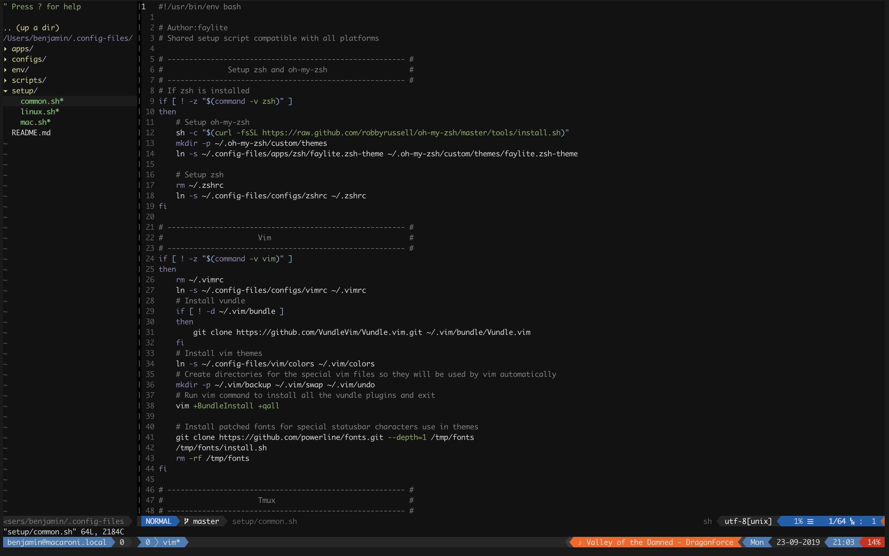

# Config Files

> My configuration files for mac and linux machines



## Features

- Vim
  - Pre-configured vim with a bunch of plugins installed through vundle.
- zsh
  - Installs zsh and oh-my-zsh
  - Custom theme for oh-my-zsh
  - Productivity tweaks
- tmux
  - Custom tmux theme
  - Tailor made simple status line
    - Battery status on mac and linux
    - Song/artist status in deadbeef and iTunes
- weechat
  - Custom theme and other tweaks
- Mac specific
  - Installs homebrew automatically
- Linux specific
  - Installs i3 window manager with custom configurations

## Installation

Clone the repository to a permanent location on your system.

```bash
git clone https://github.com/faylite/config-files.git ~/.config-files
```

Afterwards run the setup script for the platform you're on.

```bash
# Linux
.config-files/setup/linux.sh

# Mac
.config-files/setup/mac.sh
```

Then run `stow` at the root of the directory to install symlinks for all the config files.

```bash
stow .
```

## Overview

> File structure

- configs
  - Generic dot files and configurations.
- apps
  - Other application related configurations, themes, etc.
- env
  - Environment files used to enable/disable options provided by these config files.
- scripts
  - Scripts used by applications, shell configurations and aliases.
- setup
  - Setup scripts used to install setup new machines with these config files.
- README.md
  - See [README.md](README)

## Options

The config files has several options available, these options are set in the environment files located in the env directory.

> See `env/.examples` directory to see available options.

### Tmux

The tmux environment file is sourced by the tmux status line scripts every time the status line updates so don't go overboard.

Options for tmux and the status line.
To enable an options we use the "TRUE" options as a text value. Any other value will be be treated as disabled.

- `TMUX_ENABLE_LINUX_BATTERY`
  - Enables the battery status for linux users
- `TMUX_ENABLE_MAC_BATTERY`
  - Enables the battery status for Mac users
- `TMUX_ENABLE_DEADBEEF`
  - Shows the currently playing song/artist for Deadbeef on Linux
- `TMUX_ENABLE_ITUNES`
  - Shows the currently playing song/artist for iTunes on Mac

